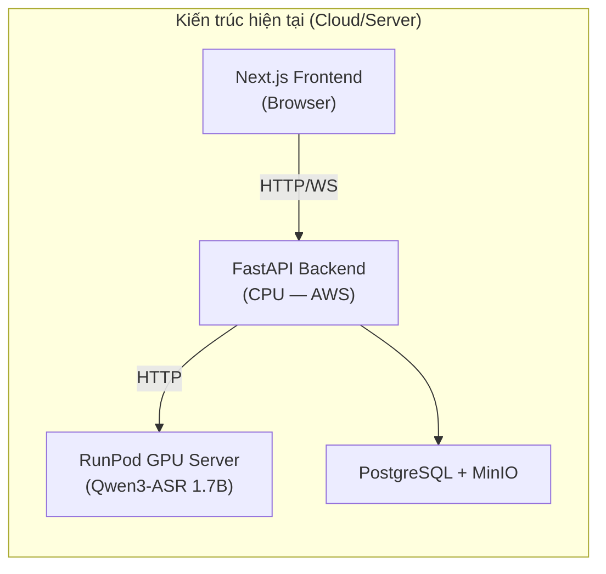
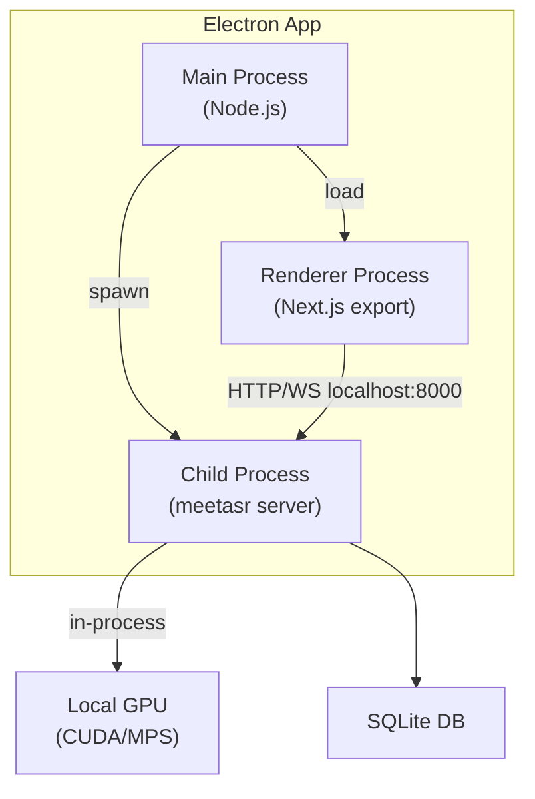
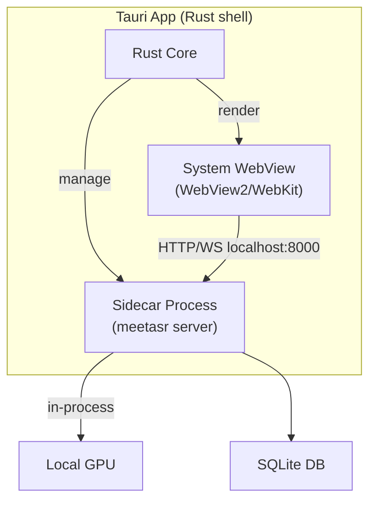
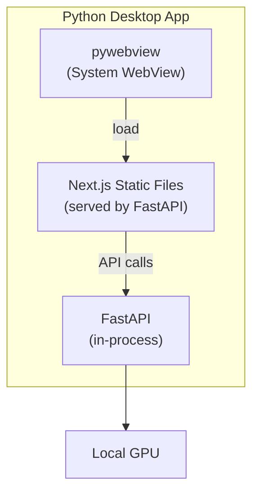

# Phân tích chuyển đổi MeetingMindAI → Desktop App (Local GPU)

## 1. Hiện trạng kiến trúc



Hệ thống hiện có **2 mode triển khai song song**:

| Mode | Mô tả | Nơi chạy GPU |
|------|--------|---------------|
| **Cloud (Production)** | `meetasr/backend/` — Backend nhẹ trên AWS, gọi RunPod qua HTTP ([`RunPodClient`](file:///home/anhtu/workspace/HIT/MeetingMindAI/meetasr/backend/services/runpod_client.py)) | RunPod (thuê) |
| **Local Dev** | `meetasr/` — Backend chạy trực tiếp pipeline ML ([`MeetPipeline`](file:///home/anhtu/workspace/HIT/MeetingMindAI/meetasr/pipeline.py)) trên máy | Local GPU |

> [!IMPORTANT]
> **Tin tốt**: Mode "Local Dev" đã hoạt động hoàn chỉnh. Lệnh `meetasr server --config meeting_config.yaml` chạy toàn bộ pipeline ML trực tiếp trên GPU của máy mà **không cần RunPod**. Đây chính là nền tảng cho bản desktop.

---

## 2. Đánh giá khả thi — Chuyển sang Desktop App

### 2.1 Những gì ĐÃ SẴN SÀNG (ít cần thay đổi)

| Thành phần | Hiện trạng | Ghi chú |
|---|---|---|
| **Pipeline ML chạy local** | ✅ Hoàn chỉnh | `MeetPipeline` hỗ trợ CPU/GPU, config qua YAML |
| **FastAPI backend local** | ✅ Hoàn chỉnh | `meetasr server` đã chạy tốt trên localhost |
| **SQLite storage** | ✅ Mặc định | Không cần PostgreSQL/MinIO khi chạy desktop |
| **Local file storage** | ✅ Mặc định | `data/media/` — lưu file trên ổ cứng local |
| **CLI** | ✅ Hoàn chỉnh | `meetasr transcribe`, `meetasr server` |
| **Model tự tải & cache** | ✅ Tự động | Lần đầu tải từ HuggingFace, sau đó dùng cache |
| **Frontend giao tiếp backend** | ✅ Qua HTTP/WS | `NEXT_PUBLIC_MEETASR_API=http://127.0.0.1:8000` |

### 2.2 Những gì CẦN PHÁT TRIỂN THÊM

| Thành phần | Mức độ | Mô tả |
|---|---|---|
| **Desktop shell (Electron/Tauri)** | 🔴 Lớn | Đóng gói Next.js + Backend vào 1 ứng dụng cài được |
| **Process orchestrator** | 🟡 Trung bình | Khởi động/dừng FastAPI backend từ trong app |
| **GPU detection & fallback** | 🟡 Trung bình | Tự phát hiện GPU, chọn config phù hợp |
| **Installer & packaging** | 🟡 Trung bình | NSIS/MSI (Win), DMG (Mac), AppImage/deb (Linux) |
| **Auto-update** | 🟢 Nhỏ | Tuỳ chọn, có thể dùng sau |
| **System tray / UX desktop** | 🟢 Nhỏ | Icon tray, notification OS-level |

---

## 3. Các phương án triển khai Desktop

### Phương án A: Electron + Next.js (Frontend) + FastAPI subprocess (Backend)



**Cách hoạt động:**
1. Electron main process spawn `meetasr server --port 8000` như child process
2. Renderer load Next.js static export (`next export` hoặc `next build && next start`)
3. Frontend gọi API tới `http://localhost:8000` — **không đổi gì so với hiện tại**

| Ưu điểm | Nhược điểm |
|---|---|
| Tận dụng 100% code hiện có | Bundle size lớn (~200-400MB + models) |
| Next.js rendering giữ nguyên | Cần ship Python runtime + CUDA toolkit |
| Hệ sinh thái plugin phong phú | RAM overhead của Chromium (~150MB) |
| Cross-platform (Win/Mac/Linux) | Phức tạp hóa quá trình build |

### Phương án B: Tauri v2 + Next.js SSG + FastAPI sidecar



**Cách hoạt động:**
- Tauri dùng system WebView thay vì bundle Chromium
- FastAPI backend chạy như "sidecar" (binary đóng gói bằng PyInstaller/cx_Freeze)

| Ưu điểm | Nhược điểm |
|---|---|
| Bundle nhỏ hơn Electron (~50-80MB shell) | Tauri v2 còn ít tài liệu hơn Electron |
| Dùng WebView hệ thống, ít RAM hơn | Cross-platform WebView rendering khác nhau |
| Rust core mạnh cho IPC, file system | Build pipeline phức tạp (Rust + Python + JS) |
| Bảo mật tốt hơn (sandbox mặc định) | Team cần học thêm Rust cơ bản |

### Phương án C: Python-only Desktop (PyWebView + FastAPI)



**Cách hoạt động:**
- `pywebview` mở cửa sổ native với system WebView
- FastAPI phục vụ cả static frontend files lẫn API
- Đóng gói toàn bộ bằng PyInstaller

| Ưu điểm | Nhược điểm |
|---|---|
| Stack đơn giản nhất (chỉ Python) | pywebview hạn chế tính năng desktop (menu, tray) |
| Không cần Node.js trong runtime | Next.js SSR features bị mất (chỉ SSG) |
| Team đã quen Python | UX kém native nhất trong 3 phương án |
| Build & debug nhanh nhất | Khó mở rộng tính năng desktop sau này |

---

## 4. Phương án khuyến nghị

> [!TIP]
> **Phương án A (Electron)** là lựa chọn thực tế nhất cho team hiện tại, vì:
> 1. **Thay đổi code ít nhất** — Frontend giữ nguyên Next.js, Backend giữ nguyên FastAPI
> 2. **Team đã quen** — JavaScript/TypeScript + Python, không cần học Rust
> 3. **Hệ sinh thái trưởng thành** — Auto-update (electron-updater), installer (electron-builder), system tray có sẵn
> 4. **Nếu muốn tối ưu sau** — Có thể migrate sang Tauri v2 khi team quen Rust

---

## 5. Yêu cầu phần cứng & Đánh đổi khi dùng Local GPU

### 5.1 Yêu cầu tối thiểu

| Thành phần | Tối thiểu | Khuyến nghị |
|---|---|---|
| **GPU VRAM** | 4GB (Qwen3-ASR 1.7B bfloat16) | 6-8GB |
| **RAM** | 8GB | 16GB |
| **Disk** | ~5GB (models + app) | 10GB+ (cache + data) |
| **OS** | Windows 10+, Ubuntu 20.04+, macOS 12+ | — |
| **CUDA** | 11.8+ (NVIDIA) | 12.1+ |

### 5.2 Ma trận đánh đổi: Local GPU vs RunPod

| Tiêu chí | Local GPU (Desktop) | RunPod (Cloud) |
|---|---|---|
| **Chi phí** | ✅ \$0/tháng (đã có GPU) | ❌ ~\$0.4-0.8/giờ GPU |
| **Latency** | ✅ Cực thấp (no network) | ❌ +100-500ms roundtrip |
| **Offline** | ✅ Hoạt động không cần internet | ❌ Bắt buộc có mạng |
| **Bảo mật** | ✅ Dữ liệu không rời máy | ⚠️ Audio gửi lên cloud |
| **Scalability** | ❌ 1 user/máy, phụ thuộc phần cứng | ✅ Scale tùy ý |
| **Setup** | ❌ Cần cài CUDA driver, ~5GB models | ✅ Zero setup cho end-user |
| **GPU yếu/không có** | ❌ Chạy CPU rất chậm | ✅ Luôn có GPU mạnh |
| **Đa người dùng** | ❌ Không phù hợp | ✅ Thiết kế cho multi-user |

### 5.3 Rủi ro cần lưu ý

> [!WARNING]
> 1. **Máy user không có NVIDIA GPU**: Cần fallback về CPU (chậm 5-10x) hoặc hiển thị cảnh báo rõ ràng
> 2. **VRAM không đủ**: Qwen3-ASR 1.7B cần ~3.5GB VRAM. Nếu user đang chơi game hoặc chạy app khác chiếm VRAM → crash
> 3. **CUDA driver mismatch**: Phiên bản CUDA driver trên máy user phải tương thích với PyTorch build
> 4. **Model download lần đầu**: ~3-4GB tải từ HuggingFace, cần UX progress bar rõ ràng
> 5. **macOS**: Apple Silicon không có CUDA, phải dùng MPS backend (PyTorch MPS) — hiệu năng kém hơn CUDA

---

## 6. Kế hoạch triển khai (Phương án A — Electron)

### Phase 1: Proof of Concept (2-3 tuần)

```
1. Electron shell cơ bản
   → verify: App mở được, hiển thị cửa sổ

2. Spawn FastAPI backend như child process
   → verify: meetasr server khởi động từ trong Electron, 
             health check http://localhost:8000/v1/health trả OK

3. Load Next.js static export vào Electron
   → verify: Trang chính hiển thị, upload file hoạt động

4. GPU detection logic
   → verify: Tự chọn cuda:0 nếu có NVIDIA GPU, fallback CPU
```

### Phase 2: Packaging & UX (2-3 tuần)

```
5. Bundle Python runtime + dependencies (PyInstaller hoặc conda-pack)
   → verify: App chạy trên máy sạch không cần cài Python

6. First-run model download UX
   → verify: Progress bar hiển thị khi tải model lần đầu

7. System tray, graceful shutdown
   → verify: Đóng cửa sổ → app thu vào tray, thoát → FastAPI dừng sạch

8. Installer (electron-builder)
   → verify: File .exe/.dmg/.AppImage cài được trên máy sạch
```

### Phase 3: Production-ready (2-3 tuần)

```
9. Auto-update (electron-updater + GitHub Releases)
   → verify: App tự phát hiện và cài bản mới

10. Error handling & logging
    → verify: Crash logs lưu file, user có thể gửi report

11. Multi-GPU / GPU selection UI
    → verify: User chọn được GPU nếu máy có nhiều card

12. Xoá dependency RunPod khỏi flow desktop
    → verify: Không có request nào ra ngoài trừ tải model lần đầu
```

---

## 7. Thay đổi code cần thiết

### 7.1 Backend — Rất ít thay đổi

Chỉ cần chỉnh [`ASRService.__init__`](file:///home/anhtu/workspace/HIT/MeetingMindAI/meetasr/services/asr_service.py#L35-L36) để **không fallback** sang `RunPodClient` khi chạy desktop:

```python
# Hiện tại (line 36):
self.client = pipeline if pipeline is not None else RunPodClient()

# Đổi thành:
if pipeline is None:
    raise RuntimeError("Desktop mode requires a local pipeline")
self.client = pipeline
```

Và thêm logic detect GPU vào [`auto_pipeline.py`](file:///home/anhtu/workspace/HIT/MeetingMindAI/meetasr/auto/auto_pipeline.py):

```python
def _auto_detect_device() -> str:
    import torch
    if torch.cuda.is_available():
        return "cuda:0"
    if hasattr(torch.backends, "mps") and torch.backends.mps.is_available():
        return "mps"
    return "cpu"
```

### 7.2 Frontend — Gần như không đổi

Chỉ cần đảm bảo `NEXT_PUBLIC_MEETASR_API=http://127.0.0.1:8000` và build static:

```bash
cd frontend-next
NEXT_PUBLIC_MEETASR_API=http://127.0.0.1:8000 pnpm build
```

### 7.3 Electron — Code mới (~200-300 dòng)

```
electron/
├── main.js          # Electron main process, spawn FastAPI
├── preload.js       # Bridge giữa main ↔ renderer
├── gpu-detect.js    # Detect CUDA/MPS availability
└── package.json     # Electron dependencies
```

---

## 8. Tóm tắt

| Câu hỏi | Trả lời |
|---|---|
| **Có khả thi không?** | ✅ **Rất khả thi** — pipeline local đã hoạt động hoàn chỉnh |
| **Cần viết lại code không?** | ❌ Không — chỉ thêm Electron shell (~300 dòng) và config nhỏ |
| **Mất bao lâu?** | ~6-9 tuần cho bản production-ready |
| **Rủi ro lớn nhất?** | Đa dạng phần cứng user (GPU/VRAM/driver) và kích thước bundle |
| **Đánh đổi chính?** | Mất scalability, được privacy + offline + zero cost |
